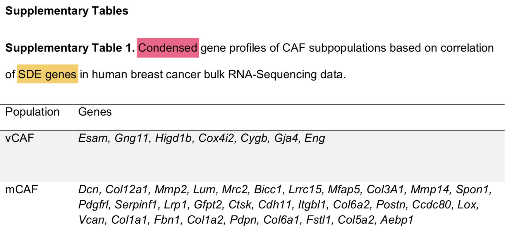
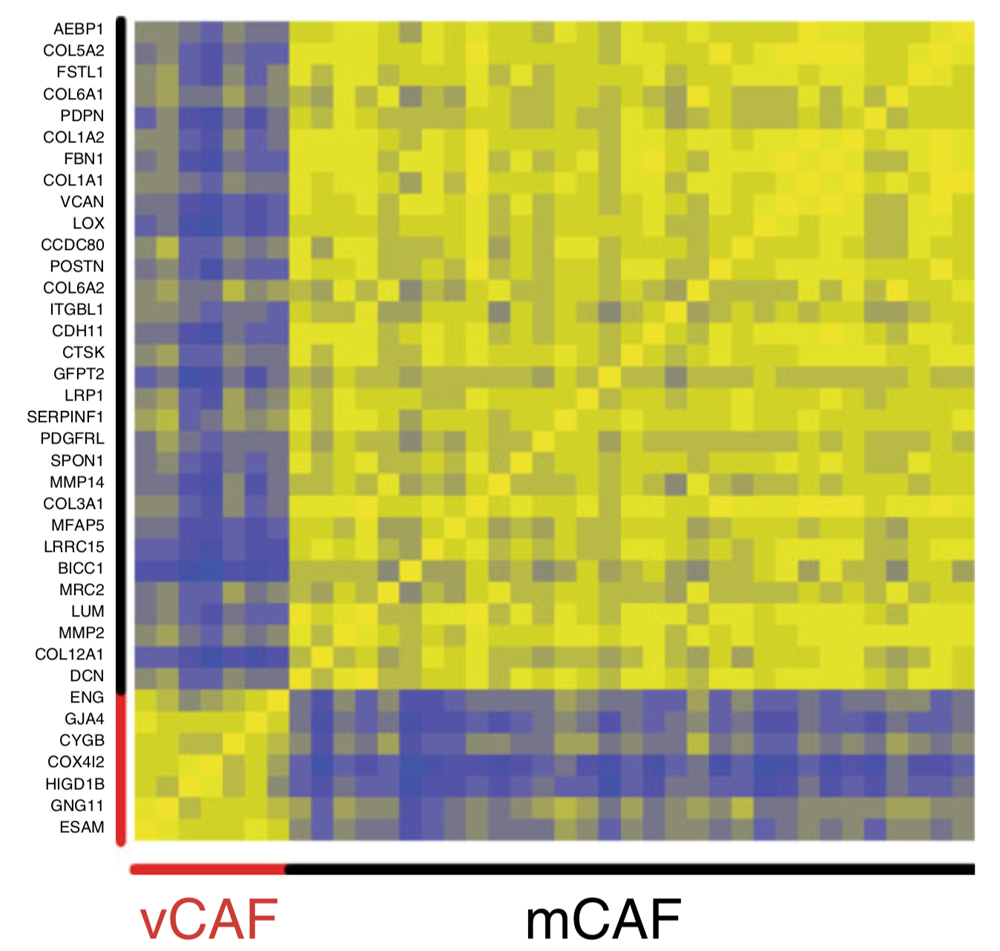
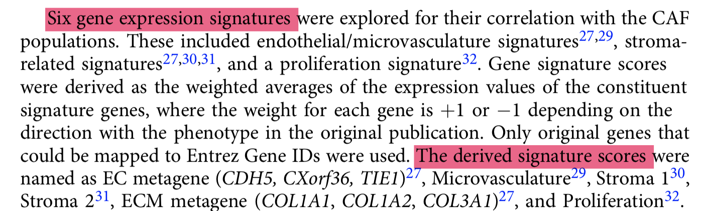
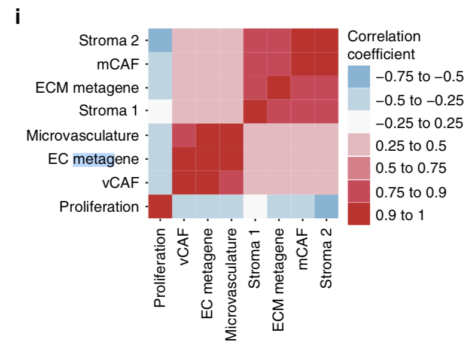

# 单元四 - 公共数据库整合分析

单细胞转录组数据分析是文章的精华，但是基于生物学背景的公共数据库整合挖掘也必不可少，这里完全模仿文章的分析流程，提供大家在自己的领域触类旁通的技能底蕴。

- 下载TCGA数据库的BRCA样本的array和seq的表达矩阵
- 下载METABRIC数据库的表达矩阵
- 下载参考文献的乳腺癌数据集
- 下载6个参考文献的基因集
- 不同基因集在不同数据集的相关性分析

### 首先回顾一下4种CAF

经过tsne加上dbscan流程，把CAF细胞分成了4组，并且取top150差异基因进行GO数据库功能注释，如下：

作者对这4类细胞进行了描述：

- Due to the close correlation of the SDE genes in vCAFs with genes involved in vascular development
- Indeed, only cell cycle genes were found to be differentially expressed between cCAFs and vCAFs
- The mCAF subset of the tumor stroma specifically expressed transcripts of a large variety of ECM-related genes
- dCAFs may originate from tumor cells that have undergone an epithelial-to-mesenchymal transition (EMT).

### 现在开始探索vCAF和mCAF

#### 首先拿到vCAF和mCAF基因集，在附件，如下表；

人和鼠基因名字大小写转换即可

#### 然后使用这些基因去TCGA数据库算相关性

如下；

#### 再拿到6个基因集

根据文章描述，拿到6个参考文献，从里面提取基因集，如下：

#### 基因集之间的散点图

每个基因集的基因列表都是有的，所以重点是算metagene的值，相关性图如下：

#### 全部基因的相关性热图

这个时候，数据集是 nested **case–control study** dataset of breast cancer patients ，从文章看是参考文献28，29，数据集是 The nested case-control study included 768 study subjects corresponding to 623 primary tumor samples. This QC substudy comprises 97 of the study subjects (all different primary tumor samples). 

- <https://www.ncbi.nlm.nih.gov/geo/query/acc.cgi?acc=Gse48091>
- <https://www.ncbi.nlm.nih.gov/geo/query/acc.cgi?acc=GSE81954> 

### 基因集的生存分析

这里作者把基因集的metagene当做一个指标把病人分类即可。

